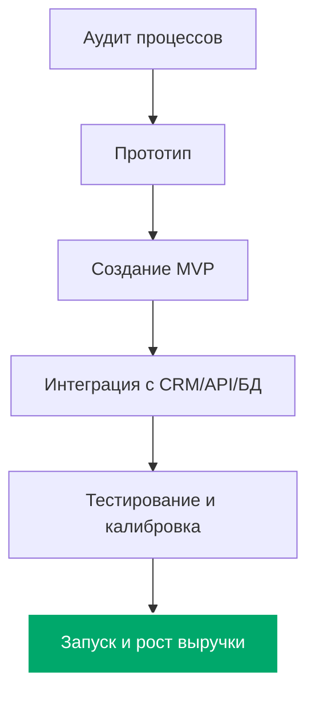

<!-- GitHub Stats Widgets -->

  
  

<!-- Banner -->

  

# Внедрение ИИ в бизнес-процессы с гарантией роста выручки

Привет! Меня зовут Прошинский Владислав,
Я автоматизирую  повторяющиеся бизнес-процессы с помощью  искусственного интеллекта. 
Я и моя команда внедряем ИИ решения в ключевые процессы бизнеса:  коммерческие (которые растят выручку:  маркетинг, продажи, продукт) и операционные (поддерка,  бухгалтерия, юридические функции).

Вся интеграция проходит незаметно для вашей текущей работы. Мы подключаем ИИ-агентов к существующим CRM, базам данных и мессенджерам.

[Обсудить проект в Telegram](https://t.me/AImademyday) | [Посмотреть кейсы на сайте](https://proshinsky.com/)

---

## ИИ-решения по сегментам бизнеса

Я разделил готовые инструменты по отделам, чтобы вы могли сразу оценить пользу для конкретных задач вашей компании.

### Для руководителей

*   **Расчет P&L и Unit-экономики.** Автоматически выгружает финансовые показатели из ваших таблиц и расчетных счетов, считает Unit-экономику и находит точки оптимизации. Легко связывается с Google Sheets и банковскими выписками.
*   **Сбор отчетов и алерты в Telegram.** Собирает данные из CRM, Roistat, таблиц и баз данных. Присылает готовые отчеты по расписанию и мгновенно сигнализирует в чат при отклонении метрик от нормы.
*   **Автоматизация переписки (почта, Telegram).** Анализирует входящие сообщения, сортирует их по приоритету, готовит черновики ответов на типовые вопросы и берет на себя управление рутинными чатами.
*   **Генерация договоров по шаблону.** Создает заполненные на 80% договоры подряда, оказания услуг или любые другие документы по вашим корпоративным шаблонам всего за 5 минут.

### Для отдела продаж

*   **Голосовой AI-обзвон клиентов.** Робот обзванивает базу контактов, квалифицирует лиды по заданным вопросам и передает «горячих» клиентов живым менеджерам. Делает до 100 звонков в час и интегрируется с CRM.
*   **Создание КП за секунды.** ИИ слушает аудиозапись встречи (стенограмму) или анализирует бриф, после чего формирует коммерческое предложение, бьющее точно в боли клиента. Процесс занимает 15 минут вместо 2 часов.
*   **Подготовка менеджеров ко встречам.** Собирает подробное досье на компанию и лицо, принимающее решения (ЛПР), перед началом переговоров: последние новости, проблемы бизнеса и проекты конкурентов.
*   **Контроль качества звонков (AI ОКК).** Анализирует до 100% звонков и переписок менеджеров. Автоматически оценивает их по вашему чек-листу в реальном времени и подсвечивает ошибки.
*   **Гипер-персонализация писем.** Автоматически генерирует уникальные цепляющие письма для ЛПР на основе открытых данных о них. Позволяет рассылать от 10 000 писем в день через email и мессенджеры.
*   **Автоматическая отправка КП.** Интегрируется с CRM, на основе запроса клиента и базы услуг компании создает персонализированный документ за 5 минут и сам отправляет его на почту.
*   **RAG-ассистент в реальном времени.** Подсказывает сотруднику во время телефонного разговора с клиентом, какие аргументы и ответы на возражения использовать, чтобы закрыть сделку.

### Для маркетинга

*   **Исследование рынка и ниш.** За 30 минут собирает информацию о рынке, основных конкурентах и актуальных трендах, формируя отчет с выводами и рекомендациями.
*   **Генератор рекламных баннеров.** Создает десятки вариантов рекламных креативов на основе вашего брендбука и ТЗ через связку с Midjourney, DALL-E и Stable Diffusion.
*   **Мониторинг упоминаний бренда.** Отслеживает появление бренда в социальных сетях, медиа и на форумах. Моментально присылает уведомления о негативных отзывах и собирает общую аналитику.
*   **Разработка Go-to-Market стратегий.** Анализирует данные о вашем продукте, конкурентах и целевой аудитории, выдавая готовую GTM-стратегию с каналами продвижения, месседжами и таймлайном.
*   **Оценка ROMI рекламных кампаний.** Собирает данные из рекламных кабинетов и CRM. Считает реальный возврат инвестиций по каждой кампании и дает рекомендации по перераспределению бюджета.

### Для продуктовых команд

*   **Сбор и анализ отзывов.** Автоматически выгружает отзывы из App Store, Google Play, соцсетей и отзовиков. Группирует их по категориям (баги, неудобный интерфейс, запросы новых фич) и присылает дайджест в Telegram.
*   **Синтетические исследования (AI-интервью).** Позволяет проводить интервью с виртуальными "персонами" ваших клиентов, смоделированными на основе реальных данных. Валидация продуктовых гипотез занимает минуты вместо недель.

### Для финансов

*   **Мониторинг цен конкурентов.** Сканирует сайты конкурентов, фиксирует изменения в стоимости товаров или услуг, мгновенно отправляет уведомления о демпинге и собирает сравнительные отчеты.
*   **Анализ данных на естественном языке.** Подключается напрямую к SQL, API и таблицам. Позволяет общаться с базой данных простыми вопросами, например: «Какая выручка была за прошлую неделю по категории X?»

---

## Как проходит интеграция

Мы работаем по понятной схеме, которая исключает риски для ваших текущих продаж и операционки:

1. **Аудит процессов** Проводим встречу, находим рутинные задачи и узкие места, где ИИ окупится быстрее всего.
2. **Прототип** Разрабатываем концепт и логику работы ИИ-агента для согласования механики без полноценной разработки.
3. **Создание MVP** Создаем рабочую версию решения на реальных данных за 2-3 недели, чтобы подтвердить пользу на практике.
4. **Интеграция с CRM/API/БД** Соединяем готовое решение с вашей CRM, ERP, мессенджерами и корпоративным софтом.
5. **Тестирование и калибровка** Тестируем точность работы моделей, калибруем ответы и доводим показатели до плановых.
6. **Запуск и рост выручки** Передаем систему команде, обучаем сотрудников и отслеживаем окупаемость.

---

## Кейсы внедрения ИИ в бизнес

*   **Кейс 1: Автоматизация поддержки интернет-магазина.** Разработал ИИ-агента для обработки 70% входящих обращений в Telegram и WhatsApp. Время ответа сократилось с 15 минут до 5 секунд, расходы на поддержку снизились на 42%.
*   **Кейс 2: Умный скоринг B2B-лидов.** Внедрил ИИ для скоринга заявок на основе открытых данных о компаниях. Конверсия из лида в сделку выросла на 18%, менеджеры перестали тратить время на мусорные звонки.
*   **Кейс 3: Контроль качества звонков.** Подключил ИИ к IP-телефонии для оценки 100% звонков отдела продаж по чек-листам скрипта. Средний чек вырос на 12% за счет выявления упущенных менеджерами допродаж.

---

## Стоимость внедрения ИИ в бизнес

| Направление | Что входит | Срок | Стоимость |
| :--- | :--- | :--- | :--- |
| **Аудит и консалтинг** | Поиск точек роста, проектирование архитектуры, расчет ROI | 1-2 недели | **Бесплатно** |
| **MVP (Пилотный проект)** | Разработка базового ИИ-агента для одной ключевой задачи | 2-3 недели | от 150 000 ₽ |
| **Интеграция под ключ** | Полное внедрение ИИ в процессы, связь с CRM/ERP | 1-2 месяца | от 350 000 ₽ |
| **Кастомные AI-агенты** | Сложные мультиагентные системы, RAG базы знаний, On-Premise | от 2 месяцев | Индивидуально |

---

## Безопасность и соответствие закону

*   **Конфиденциальность данных.** Все данные клиентов и компании защищены NDA. Запросы не используются для обучения публичных моделей.
*   **Соответствие 152-ФЗ.** ИИ работает строго в рамках законодательства о персональных данных.
*   **Локальное развертывание (On-Premise).** Если требуется полная независимость, мы можем установить открытые ИИ-модели на ваши собственные серверы.

---

## Как начать сотрудничество

1.  **Свяжитесь со мной:** Напишите в Telegram [@AImademyday](https://t.me/AImademyday) или оставьте заявку на [proshinsky.com](https://proshinsky.com/).
2.  **Бесплатный аудит:** Мы проведем 30-минутный разбор ваших процессов и найдем 3 сценария внедрения ИИ, которые гарантированно окупят себя.

---

## SEO-ключи для поиска

внедрение ии в бизнес, внедрение ии в бизнес процессы, внедрение ии в бизнес решения, внедрение ии агентов в бизнес, внедрение ии в бизнес под ключ, кейс внедрения ии в бизнес, кейсы внедрения ии в российский бизнес, компания по внедрению ии в бизнес, услуги внедрение ии в бизнес, специалист по внедрению ии в бизнес, внедрение ии в бизнес стоимость, автоматизация бизнес-процессов с помощью ии, разработка ии для бизнеса, ии для автоматизации продаж, внедрение нейросетей в бизнес под ключ

---

> Предложение носит информационный характер и фиксируется индивидуальным договором об оказании услуг.

Поделитесь этим репозиторием, если планируете автоматизацию бизнес-процессов с помощью искусственного интеллекта.
Узнайте больше на [proshinsky.com](https://proshinsky.com/).
