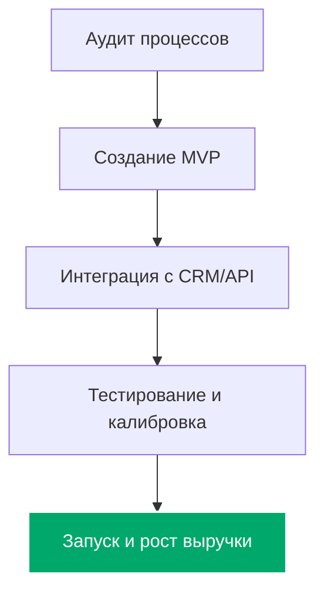

<!-- GitHub Stats Widgets -->

  
  
  

<!-- Banner -->

  

# 🧠 Внедрение ИИ в бизнес-процессы с гарантией роста выручки

---

## 🌐 Введение

В эпоху стремительной цифровизации ключевым фактором выживания и масштабирования компаний становится автоматизация рутины и интеллектуальный анализ данных. **Внедрение ИИ в бизнес** — это не просто дань моде, а технологический рычаг, позволяющий сократить операционные расходы на 30–50% и кратно увеличить конверсию в продажи.

Как ведущая **компания по внедрению ИИ в бизнес**, мы предлагаем профессиональные услуги по интеграции искусственного интеллекта и нейросетей в коммерческие структуры с фокусом на измеримый финансовый результат. Каждый наш **специалист по внедрению ИИ в бизнес** ориентирован на окупаемость решений. Все продукты бесшовно встраиваются в текущую инфраструктуру и фиксируются юридическим договором с гарантией роста выручки.

---

## 📚 Наши ключевые услуги

Мы предлагаем комплексный подход, когда вам требуется качественное **внедрение ИИ в бизнес под ключ**:

- Разработка кастомных ИИ-агентов и нейросетевых помощников
- Автоматизация рутинных задач и бизнес-процессов
- Интеграция больших языковых моделей (LLM) в CRM и Helpdesk системы
- Разработка ИИ для бизнеса под ключ и интеграция с корпоративным софтом

---

### ⚙️ Внедрение ИИ в бизнес-процессы

Системное **внедрение ИИ в бизнес-процессы** позволяет автоматизировать задачи любой сложности:

- **Интеллектуальная обработка документов:** распознавание, классификация и извлечение данных из счетов, договоров и актов.
- **Умная маршрутизация заявок:** автоматическое распределение обращений клиентов по профильным отделам.
- **Индивидуальные ИИ-решения:** проектирование логики под уникальные цепочки создания ценности в вашей компании.

### 🤖 Внедрение ИИ-агентов в бизнес

Современное **внедрение ИИ-агентов в бизнес** (AI Agents) полностью заменяет линейный персонал на рутинных участках:

- **Автономные агенты поддержки:** ИИ-агенты, имеющие доступ к базам данных, которые самостоятельно решают проблемы клиентов (оформление возвратов, проверка статуса заказа, выписка счетов) без привлечения людей.
- **Агенты-аналитики:** собирают отчеты, анализируют метрики и присылают аномалии в работе отделов в Telegram или Slack.
- **Интеграция через n8n/Make:** связываем ИИ-агентов с любыми вашими системами через гибкие сценарии автоматизации.

### 📈 ИИ для автоматизации продаж и маркетинга

Использование **ИИ для автоматизации продаж** напрямую влияет на прибыль:

- **Умные чат-боты (AI Sales Agents):** квалификация лидов, выявление потребностей, презентация продукта и закрытие сделки в Telegram, WhatsApp или на сайте 24/7.
- **Персонализация предложений:** анализ истории покупок клиента и автоматическая генерация рекомендаций с максимальной вероятностью апсейла.
- **Анализ звонков менеджеров:** автоматическая оценка разговоров по чек-листу, выявление сильных сторон и зон роста, контроль соблюдения скрипта.

### 🛠️ Разработка ИИ для бизнеса под ключ

Полный цикл разработки — **разработка ИИ для бизнеса** от идеи до запуска:

- Проектирование архитектуры решения на базе современных моделей (GPT-4, Claude 3.5, YandexGPT, локальные Llama/Mistral).
- Создание гибких интеграций с использованием n8n, Make или кастомного кода на Python/TypeScript.
- Подключение ИИ к вашим внутренним API, базам данных и CRM (amoCRM, Bitrix24).

---

## 📊 Кейсы внедрения ИИ в бизнес

Ниже представлены реальные **кейсы внедрения ИИ в российский бизнес**, демонстрирующие измеримые результаты:

### 🔹 Кейс 1: Автоматизация службы поддержки интернет-магазина
- **Что сделали:** Внедрение ИИ-агента для обработки 70% входящих запросов в Telegram и WhatsApp.
- **Результат:** Время ответа сократилось с 15 минут до 5 секунд. Операционные расходы на поддержку снизились на 42%.

### 🔹 Кейс 2: Умный скоринг и квалификация лидов в B2B
- **Что сделали:** Внедрение ИИ для анализа заявок, обогащения данных о компаниях из открытых источников и назначения приоритета менеджерам.
- **Результат:** Конверсия из лида в сделку выросла на 18%, менеджеры перестали тратить время на нецелевые контакты.

### 🔹 Кейс 3: Контроль качества звонков в отделе продаж
- **Что сделали:** Интеграция ИИ с IP-телефонией для автоматического транскрибирования и оценки 100% звонков по чек-листам скрипта продаж.
- **Результат:** Средний чек вырос на 12% за счет выявления пропущенных кросс-продаж менеджерами.

---

## 💎 Стоимость внедрения ИИ в бизнес

Финальная **стоимость внедрения ИИ в бизнес** зависит от сложности интеграции, количества обрабатываемых процессов и выбора моделей (облачные API или локальный хостинг):

| Направление | Что входит | Срок | Стоимость |
| :--- | :--- | :--- | :--- |
| **Аудит и консалтинг** | Поиск точек роста, проектирование архитектуры, расчет ROI | 1-2 недели | **Бесплатно** |
| **MVP (Пилотный проект)** | Разработка базового ИИ-агента для одной ключевой задачи | 2-3 недели | от 150 000 ₽ |
| **Интеграция под ключ** | Полноценное внедрение ИИ в бизнес-процессы, связь с CRM/ERP | 1-2 месяца | от 350 000 ₽ |
| **Кастомные AI-агенты** | Сложные мультиагентные системы, RAG базы знаний, On-Premise | от 2 месяцев | Индивидуально |

---

## 📊 Процесс интеграции решений

Внедрение искусственного интеллекта строится по проверенной методологии, минимизирующей риски для текущей операционной деятельности:

1. **Аудит и поиск точек роста:** анализируем процессы, находим узкие места, где ИИ даст максимальный прирост к выручке или экономию.
2. **Проектирование и MVP:** создаем пилотную версию решения с минимальными затратами для подтверждения гипотезы эффективности.
3. **Разработка и интеграция:** дорабатываем систему до полноценного продукта, настраиваем интеграции с CRM, ERP и мессенджерами.
4. **Тестирование и оптимизация:** проводим A/B тестирование, калибруем точность работы моделей.
5. **Запуск и поддержка:** передаем решение в эксплуатацию, обучаем команду и отслеживаем динамику роста выручки.

---

## 💼 Сферы применения

Наши решения адаптируются под специфику различных отраслей:

### E-commerce и Ритейл
- Автоматические ответы на отзывы покупателей на маркетплейсах (Wildberries, Ozon).
- Персональные товарные рекомендации и удержание корзин.
- Прогнозирование складских остатков и спроса.

### Услуги и B2B
- Квалификация и распределение входящих лидов.
- Автоматизация подготовки коммерческих предложений и тендерной документации.
- Базы знаний для технической поддержки клиентов.

### Финансы и Недвижимость
- Первичный скоринг заявок и проверка благонадежности клиентов.
- Автоматический сбор и актуализация базы объектов/услуг.
- Консультирование клиентов по сложным продуктам.

---

## 💳 Как начать работу

Для запуска процесса цифровой трансформации вашего бизнеса выполните следующие шаги:

1. **Свяжитесь с нами:** Напишите в Telegram [t.me/your_telegram_username](https://t.me/your_telegram_username)
2. **Бесплатный аудит:** Мы проведем 30-минутную онлайн-встречу, разберем ваши процессы и предложим 3 сценария внедрения ИИ с расчетом окупаемости.
3. **Согласование KPI:** Зафиксируем метрики эффективности (рост конверсии, экономия времени, рост выручки) в договоре.

---

## ⚖️ Юридическая чистота и безопасность

Безопасность ваших данных — наш приоритет:

✅ **Конфиденциальность:** все коммерческие данные и переписка клиентов защищены NDA. Запросы не используются для обучения публичных моделей.
✅ **Соответствие закону:** решения разрабатываются с соблюдением требований Федерального закона № 152-ФЗ «О персональных данных».
✅ **Локальные решения (On-Premise):** при необходимости разворачиваем открытые ИИ-модели (Open-Source) на ваших собственных серверах для полной независимости от внешних провайдеров.

---

## 📈 Преимущества работы с нами

🔹 **Гарантия окупаемости** — если внедренное решение не приносит запланированного результата, мы возвращаем деньги за разработку.  
🔹 **Бесшовная интеграция** — не ломаем ваши текущие процессы, а аккуратно встраиваемся в существующие CRM и ERP системы.  
🔹 **Кастомная разработка** — не предлагаем шаблоны; собираем архитектуру точно под регламенты вашей компании.  
🔹 **Прозрачная аналитика** — вы видите детальные дашборды эффективности работы ИИ-агентов.

---

## 🏁 Заключение

Интеграция технологий искусственного интеллекта (**внедрение ИИ в бизнес**) сегодня — это главное конкурентное преимущество. Мы помогаем компаниям переходить на новый уровень эффективности через комплексную **автоматизацию бизнес-процессов с помощью ИИ**, умное **внедрение ИИ в бизнес под ключ** и разработку систем **ИИ для автоматизации продаж**.

Инвестируйте в технологии, которые окупают себя с первых месяцев работы.

---

## 🔑 SEO ключи

<pre>внедрение ии в бизнес,
внедрение ии в бизнес процессы,
внедрение ии в бизнес решения,
внедрение ии агентов в бизнес,
внедрение ии в бизнес под ключ,
кейс внедрения ии в бизнес,
кейсы внедрения ии в российский бизнес,
компания по внедрению ии в бизнес,
услуги внедрение ии в бизнес,
специалист по внедрению ии в бизнес,
внедрение ии в бизнес стоимость,
автоматизация бизнес-процессов с помощью ии,
разработка ии для бизнеса,
ии для автоматизации продаж,
внедрение нейросетей в бизнес под ключ</pre>

---

> 📢 *Предложение носит информационный характер и фиксируется индивидуальным договором об оказании услуг.*

✨ **Поделитесь этим репозиторием, если планируете внедрение ИИ!**  
🚀 *Будущее автоматизации уже наступило — начните использовать его для роста вашего бизнеса.*
